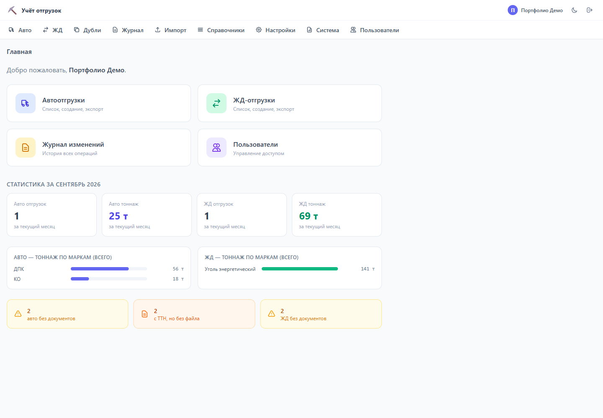
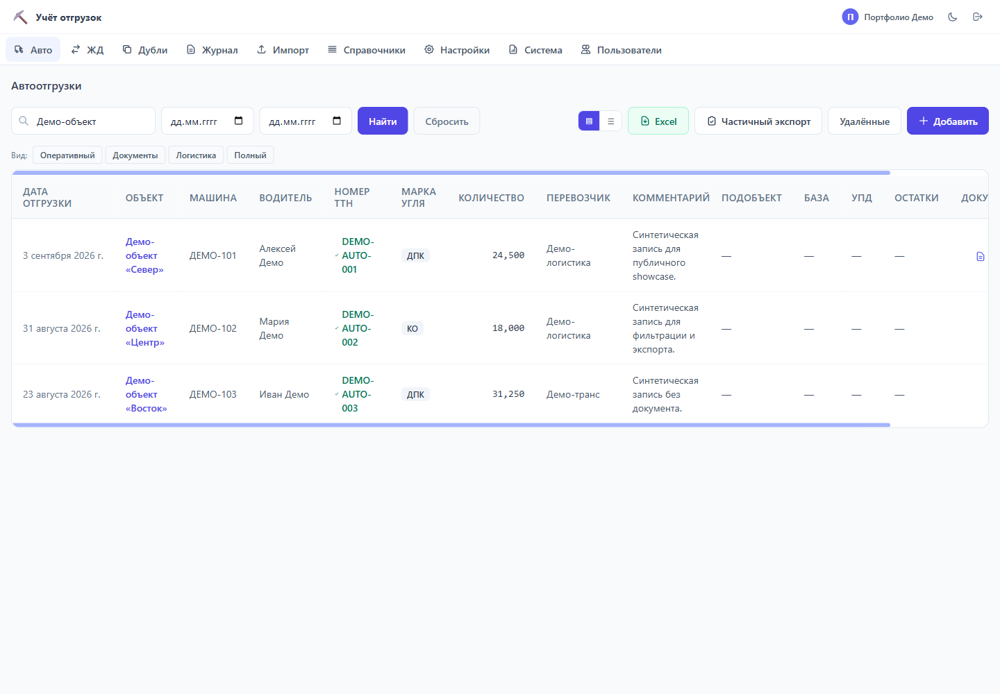
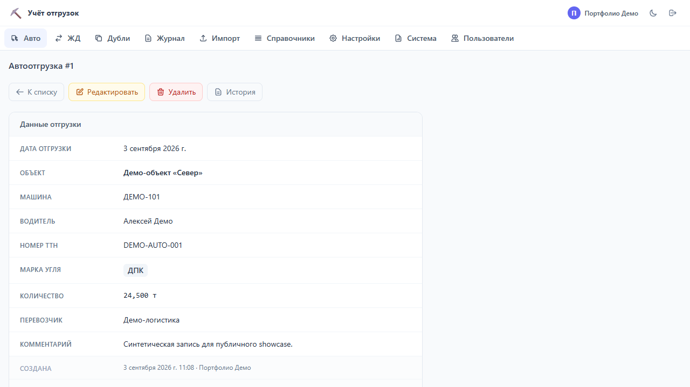
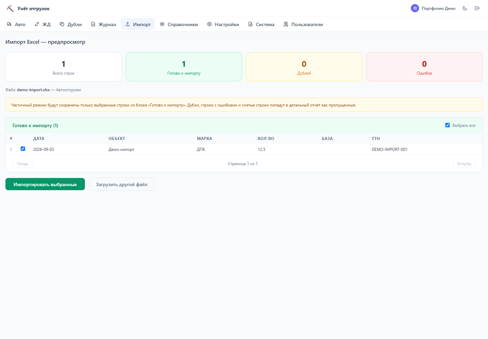
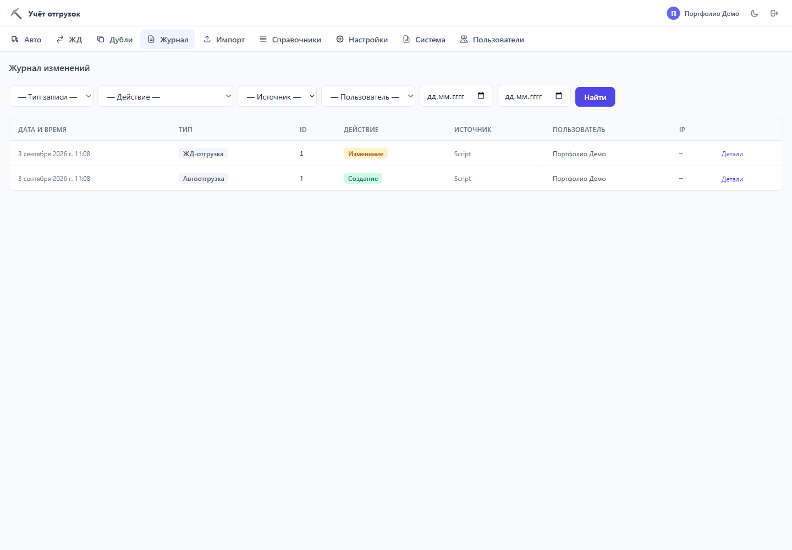
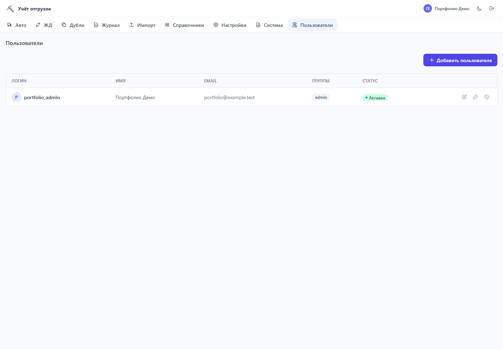
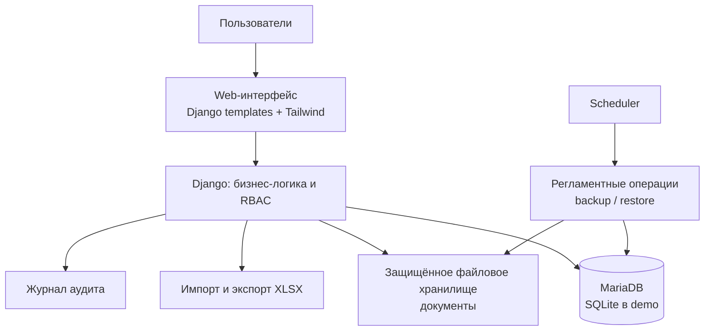

# Coal Shipments — portfolio showcase

> Внутренняя веб-система учёта автомобильных и железнодорожных отгрузок. Публичная
> витрина подготовлена на синтетических данных и не содержит данных заказчика.


## Задача

Общий Excel-файл плохо подходит для одновременной работы, контроля доступа и
прослеживаемости операций. Это MVP / pre-production система, которая переносит
учёт отгрузок в многопользовательский веб-интерфейс с ролями, безопасной работой
с файлами и воспроизводимой поставкой.

## Что реализовано

- учёт авто- и ЖД-отгрузок: создание, редактирование, soft delete и восстановление;
- поиск, фильтры по колонкам, сортировка, pagination и Excel export;
- импорт XLSX с preview, валидацией, проверкой дублей и построчным результатом;
- загрузка документов вне БД с проверкой расширения, размера и MIME-содержимого;
- RBAC на основе Django permissions, журнал изменений и управление справочниками;
- dashboard с месячными показателями, тоннажем по маркам и контролем документов;
- Docker runtime, healthcheck, отдельный scheduler для backup/restore и release gate.

## Интерфейс

Все экраны ниже используют только данные, созданные `seed_portfolio_demo`.

| Dashboard | Фильтрация списка |
|---|---|
|  |  |
| Карточка и документы | Предпросмотр Excel-импорта |
|  |  |
| Журнал аудита | Управление ролями |
|  |  |


## Стек

Python 3.13, Django 5.2 LTS, MariaDB 10, SQLite для разработки, Docker, gunicorn,
openpyxl, Tailwind CSS, pytest, Playwright, Ruff.

## Архитектура



Диаграмма отражает целевую архитектуру; в публичном demo используются SQLite и
синтетические данные. Внешних LLM, API и webhook-интеграций в продукте нет.

## Быстрый запуск demo

Для просмотра интерфейса не нужны внешняя БД, ключи или реальные документы.

```bash
docker compose up --build
```

Откройте <http://localhost:8000> и войдите:

```text
login:    portfolio_admin
password: portfolio-demo
```

Compose использует SQLite и создаёт только синтетические demo-данные. Он
предназначен для локального просмотра showcase, а не для production-развёртывания.
Остановить контейнер: `docker compose down`.

### Локальный запуск без Docker

```bash
python -m venv .venv
.venv\Scripts\Activate.ps1  # Windows PowerShell
python -m pip install -r app/requirements-dev.txt
cd app
python manage.py migrate
python manage.py seed_portfolio_demo
python manage.py runserver
```

## Качество и проверка

```bash
python -m pytest app
python -m ruff check app
npm ci
npm run check:css
cd e2e
npm ci
npm test
```

GitHub Actions запускает Python-тесты, Ruff и проверку CSS. MariaDB/Docker
acceptance намеренно вынесен за пределы CI: он требует production-like окружения
и фиксируется отдельным runbook.

Последняя локальная верификация этой showcase-копии: **1002 pytest passed**,
Ruff и CSS drift check — без замечаний; Chromium прошёл 5 критических e2e-flow.
Firefox в текущем Windows-окружении тайм-аутился после Chromium-прогона, поэтому
кросс-браузерный результат не заявляется без отдельного чистого запуска.

## AI-assisted development

При работе над проектом я использовал Claude Code и OpenAI Codex для
декомпозиции задач, реализации, тестирования и подготовки документации. Это не
LLM-функция продукта: все изменения проверялись тестами, линтером и ручными
сценариями, а ответственность за архитектурные и продуктовые решения оставалась
за мной.

Подробнее об устройстве и инженерных решениях — в
[технической документации](docs/wiki/README.md).

## Статус и границы

Проект функционально готов как MVP и проверен локальными, e2e и release checks.
Он не заявляется как production-система: финальные проверки на целевой
инфраструктуре и нагрузочный импорт относятся к следующему этапу. В текущей
версии нет интеграций с LLM, внешними API, OAuth или webhook’ов.

## Безопасность публичной версии

Этот репозиторий — самостоятельная очищенная копия без Git-истории. В нём нет
секретов, реальных пользователей, клиентских Excel-файлов, backups, runtime
файлов, локальных AI-конфигураций и внутренней истории разработки.
