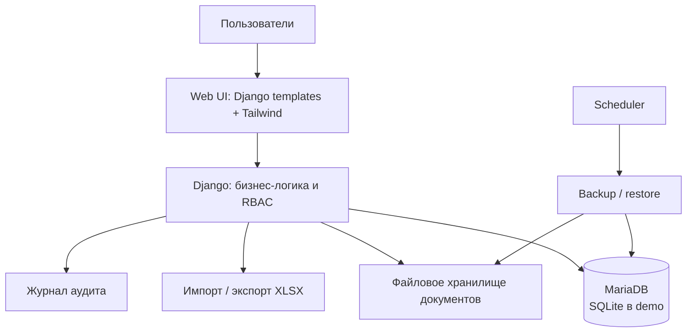

# Архитектура

Система построена как Django-монолит с серверным рендерингом шаблонов. Такой
формат подходит для внутреннего рабочего инструмента: единый код, простая
поставка и прозрачная модель прав доступа.

## Модули приложения

- `shipments_auto` и `shipments_rail` — учёт двух типов отгрузок, фильтрация,
  экспорт и soft delete;
- `imports` — предварительная проверка XLSX, диагностика строк и подтверждённый
  импорт;
- `documents` — загрузка и выдача файлов с проверками доступа;
- `accounts` — пользователи и роли;
- `audit` — неизменяемая история бизнес-операций;
- `catalogs` — управляемые справочники и настройки полей;
- `core` — dashboard, общие сервисы, системные операции и health endpoints.

## Границы окружений

Публичный Docker demo использует SQLite и синтетические данные. Целевая
production-like конфигурация предполагает MariaDB, отдельное приватное
хранилище для загрузок и резервных копий, а также HTTPS за reverse proxy.
Это не заявление о готовом production-развёртывании: проверки целевого
окружения выполняются отдельно.
