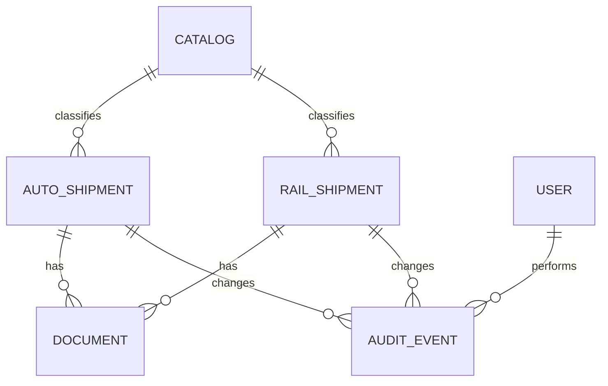

# Модель данных

Главная бизнес-сущность — отгрузка. Автомобильные и железнодорожные отгрузки
ведутся отдельно, поскольку их операционные поля различаются, но подчиняются
единым правилам доступа, поиска, аудита и жизненного цикла.

| Сущность | Назначение |
|---|---|
| Авто- и ЖД-отгрузка | Операционные данные о перевозке, контрагентских и весовых параметрах. |
| Документ | Метаданные и ссылка на файл, связанный с отгрузкой; бинарные данные не хранятся в БД. |
| Справочник | Значения для настраиваемых полей, которые можно переиспользовать в формах и фильтрах. |
| Пользователь и роль | Аутентификация и набор разрешений Django. |
| Событие аудита | Кто, когда и каким способом изменил бизнес-сущность. |

Удаление отгрузок реализовано как soft delete: запись можно восстановить, а её
история и связанные документы остаются прослеживаемыми.
